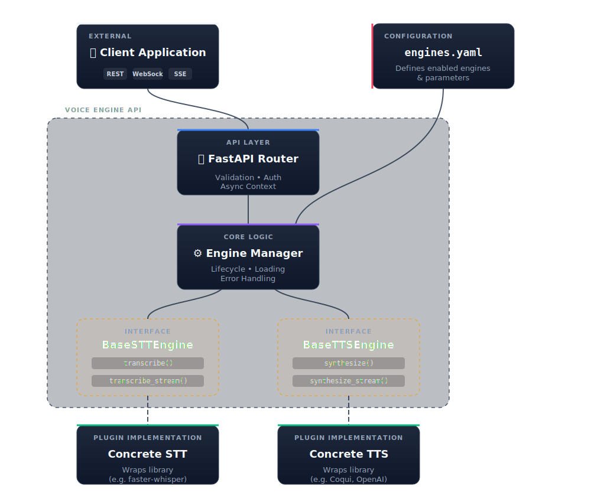

# 🎙️ VoiceCore

> **A production-ready, async-native FastAPI framework for building high-performance Speech-to-Text (STT) and Text-to-Speech (TTS) applications.**

[](https://python.org)
[](https://fastapi.tiangolo.com)
[](LICENSE)
[](https://github.com/astral-sh/ruff)

---

## ⚡ Overview

VoiceCore is a modular framework designed to simplify the integration of various speech AI models into a unified, high-performance API. Whether you need batch processing, real-time streaming via Server-Sent Events (SSE), or low-latency WebSocket communication, this project provides the robust foundation you need.

It abstracts away the complexities of model management, threading, and resource allocation, allowing you to focus on building great voice-enabled applications.

### 🌟 Key Features

| Feature | Description |
| ------- | ----------- |
| **🔌 Modular Architecture** | Plugin-based design allowing you to easily swap or add new STT/TTS engines without changing core logic. |
| **🚀 Async-Native** | Built from the ground up on modern Python `asyncio` and FastAPI for maximum concurrency and throughput. |
| **🌊 Universal Streaming** | First-class support for both **SSE** (Server-Sent Events) and **WebSockets** for real-time applications. |
| **⚙️ Declarative Config** | extensive configuration via `engines.yaml` to manage models, compute types, and devices (CPU/GPU). |
| **🛡️ Production Ready** | Includes health checks, readiness probes, OpenTelemetry-ready metrics hooks, and graceful shutdown. |
| **🐳 Docker Friendly** | Ready for containerization with environment-variable overrides for flexible deployments. |

### 🤔 Why VoiceCore?

| Feature | Why It Matters |
| ------- | -------------- |
| **Pluggable Engines** | Swap Whisper for Google/Azure/custom engines without changing application code |
| **Word-Level Timestamps** | Essential for subtitles, karaoke apps, audio-text alignment |
| **Built-in Performance Metrics** | RTF, latency, time-to-first-token included in every response |
| **Triple Streaming Modes** | Batch, SSE, and WebSocket - pick the right mode for your use case |
| **YAML Configuration** | Switch models, devices (CPU/GPU), or compute types without code changes |
| **Self-Hosted** | Full data privacy, no API costs, works offline |

---

## 🏗️ Architecture

<p align="center">
  
</p>


## 🚀 Quick Start

### 1️⃣ Installation

We recommend using **[uv](https://github.com/astral-sh/uv)** for lightning-fast dependency management, but standard `pip` works too.

```bash
# Clone the repository
git clone https://github.com/minhsaco99/VoiceCore.git
cd VoiceCore

# Install dependencies with uv
uv sync

# Install specific engine dependencies (e.g., Whisper)
uv sync --group whisper
```

### 2️⃣ Configuration

Create your engine configuration. The default `engines.yaml` is ready to go with CPU-based Whisper.

```yaml
# engines.yaml
stt:
  whisper:
    enabled: true
    engine_class: "app.engines.stt.whisper.engine.WhisperSTTEngine"
    config:
      model_name: "base"
      device: "cpu"
      compute_type: "int8"
```

### 3️⃣ Run the Server

```bash
# Start development server with auto-reload
make dev-api

# OR using uvicorn directly
uvicorn app.api.main:app --reload --host 0.0.0.0 --port 8000
```

### Deployment

```bash
# Run with Docker Compose
docker-compose up -d --build
```

See [docs/deployment.md](docs/deployment.md) for full deployment guide.

## API Overview

| Method | Endpoint | Description |
|--------|----------|-------------|
| GET | `/api/v1/health` | Health check |
| GET | `/api/v1/ready` | Readiness check (engine status) |
| GET | `/api/v1/engines` | List available engines |
| POST | `/api/v1/stt/transcribe` | Batch transcription |
| POST | `/api/v1/stt/transcribe/stream` | SSE streaming transcription |
| WS | `/api/v1/stt/transcribe/ws` | WebSocket real-time transcription |
| POST | `/api/v1/tts/synthesize` | Batch text-to-speech |
| POST | `/api/v1/tts/synthesize/stream` | Streaming text-to-speech |

See [docs/api.md](docs/api.md) for full API documentation.

## 🎮 Usage Examples

### Health Check

```bash
curl http://localhost:8000/api/v1/health
# {"status":"healthy", "version":"1.0.0"}
```

### 📝 Speech-to-Text (STT)

**Batch Transcription**

```bash
curl -X POST "http://localhost:8000/api/v1/stt/transcribe?engine=whisper" \
  -H "accept: application/json" \
  -H "Content-Type: multipart/form-data" \
  -F "file=@/path/to/audio.wav"
```

**Real-time Streaming (SSE)**

```bash
curl -N -X POST "http://localhost:8000/api/v1/stt/transcribe/stream?engine=whisper" \
  -F "file=@/path/to/audio.wav"
```

### 🔊 Text-to-Speech (TTS)

**Batch Synthesis**

```bash
curl -X POST "http://localhost:8000/api/v1/tts/synthesize?engine=voxcpm&text=Hello%20world"
```

**Streaming Synthesis**

```bash
curl -N -X POST "http://localhost:8000/api/v1/tts/synthesize/stream?engine=voxcpm&text=Hello%20world"
```

---

## 📚 Documentation

Detailed documentation is available in the `docs/` directory:

*   **[📖 API Reference](docs/api.md)**: Full details on all REST, SSE, and WebSocket endpoints.
*   **[⚙️ Configuration Guide](docs/configuration.md)**: How to configure engines, environment variables, and the `engines.yaml` file.
*   **[🛠️ Custom Engines](docs/custom-engines.md)**: A step-by-step guide to building and integrating your own STT or TTS engines.
*   **[🚀 Deployment Guide](docs/deployment.md)**: Docker and production deployment.

---

## 🧩 Supported Engines

### Speech-to-Text (STT)

| Engine | Backend | Status | Features |
| :--- | :--- | :---: | :--- |
| **Whisper** | `faster-whisper` | ✅ Ready | Word-timestamps, VAD, Beam search |
| **Google STT** | Google Cloud | 🚧 Planned | Cloud-based, massive language support |
| **Azure STT** | Azure Speech | 🚧 Planned | Enterprise-grade cloud recognition |

### Text-to-Speech (TTS)

| Engine | Backend | Status | Features |
| :--- | :--- | :---: | :--- |
| **VoxCPM** | `voxcpm` | ✅ Ready | Zero-shot voice cloning, streaming, 24kHz |
| **Coqui TTS** | `TTS` | 🚧 Planned | High-quality open source voices |
| **OpenAI TTS** | OpenAI API | 🚧 Planned | Natural sounding commercial voices |

---

## 🛠️ Development Commands

This project uses a `Makefile` to simplify common development tasks:

```bash
make dev        # Install dev dependencies
make test       # Run all tests
make lint       # Check code style with Ruff
make format     # Auto-format code
make clean      # Clean up build artifacts
```

---

## 📄 License

This project is licensed under the Apache 2.0 License - see the [LICENSE](LICENSE) file for details.
